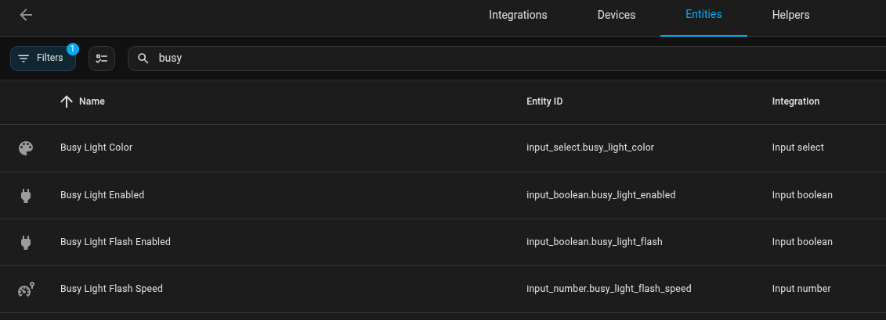
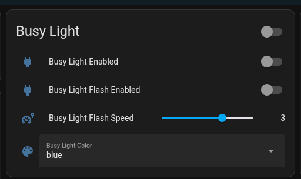

# BlyncLight MQTT Server
This is a program to automate updating an [Embrava BlyncLight](https://embrava.com/collections/blynclight-series).  This is intended to make the BlyncLight a network light and have its status updated by reading an MQTT topic. 

## Why
The ultimate goal is to control the light from Home Assistant.

## Requirements
This application uses the [BusyLight for Humans](https://pypi.org/project/busylight-for-humans/) Python package to make the device calls.  The [install](#install) process below will install the necessary dependencies.  


## MQTT
This deployment requires an MQTT server as it will update it config from the subscribed topic.


## Install

### Required Packages

````bash
python3 -m pip install -r requirements.txt
````

### Create environment file
The application needs a set of [environment variables](#environment-variables) to run correctly.  Copy the `service.env.sample` to `service.env` and update the values to match your environment.

### Service
The Python app can be run as a service.  See the instructions in the [busy-light-server.service](busy-light-server.service) file for instructions.

## Environment Variables

| Variable | Description | Default |
| --- | --- | --- |
| `LOG_FILENAME` | Location of log file | `/var/log/busylight_mqtt_server.log` |
| `LOG_LEVEL` | Sets the level of logging | `INFO` |
| `LOG_FORMAT` | Log file format | `%(message)s` |
| `MQTT_HOST` | Hostname of port of the MQTT server | `127.0.0.1` |
| `MQTT_PORT` | Port of the MQTT server | `1883` |
| `MQTT_TOPIC` | MQTT topic to monitor for state | `homeassistant/lights/busylight/state` |

## Home Assistant Integrations

### Entities

Add the following entities:

### input_select.yaml

````yaml
busy_light_color:
  name: Busy Light Color
  options:
    - "red"
    - "blue"
    - "green"
    - "yellow"
    - "magenta"
    - "cyan"
    - "silver"
    - "violet"
    - "blank"
  icon: "mdi:palette"
````

### input_number.yaml

````yaml
busy_light_flash_speed:
    name: Busy Light Flash Speed
    min: 1
    max: 4
    step: 1
    mode: slider
    icon: "mdi:car-speed-limiter"
````

### input_boolean.yaml

````yaml
busy_light_enabled:
    name: Busy Light Enabled
    icon: mdi:power-plug
busy_light_flash:
    name: Busy Light Flash Enabled
    icon: mdi:power-plug
````

The resulting entities should result in the following: 


### Automations

The following automations are what I used to get and update the entities from MQTT.  YMMV

NOTE: update `topic`if you're using a different value.

#### get_busylight_color_speed

````yaml
alias: get_busylight_color_speed
description: ""
mode: queued
triggers:
  - topic: homeassistant/lights/busylight/state
    trigger: mqtt
conditions: []
actions:
  - target:
      entity_id: input_select.busy_light_color
    data:
      option: "{{ trigger.payload_json.color_name }}"
    action: input_select.select_option
  - target:
      entity_id: input_number.busy_light_flash_speed
    data_template:
      value: "{{ trigger.payload_json.speed }}"
    action: input_number.set_value
````

#### get_busylight_flash

````yaml
alias: get_busylight_flash
description: ""
mode: queued
triggers:
  - topic: homeassistant/lights/busylight/state
    trigger: mqtt
conditions: []
actions:
  - if:
      - condition: template
        value_template: "{{ trigger.payload_json.flash | int(0) == 0}}"
    then:
      - data: {}
        target:
          entity_id: input_boolean.busy_light_flash
        action: input_boolean.turn_off
  - if:
      - condition: template
        value_template: "{{ trigger.payload_json.flash | int(0) == 1}}"
    then:
      - data: {}
        target:
          entity_id: input_boolean.busy_light_flash
        action: input_boolean.turn_on
````

#### get_busylight_state

````yaml
alias: get_busylight_state
description: ""
mode: queued
triggers:
  - topic: homeassistant/lights/busylight/state
    trigger: mqtt
conditions: []
actions:
  - if:
      - condition: template
        value_template: "{{ trigger.payload_json.on | int(0) == 0 }}"
    then:
      - data: {}
        target:
          entity_id: input_boolean.busy_light_enabled
        action: input_boolean.turn_off
  - if:
      - condition: template
        value_template: "{{ trigger.payload_json.on | int(0) == 1 }}"
    then:
      - data: {}
        target:
          entity_id: input_boolean.busy_light_enabled
        action: input_boolean.turn_on

````

#### set_busylight_to_mqtt

````yaml
alias: set_busylight_to_mqtt
description: ""
mode: queued
triggers:
  - entity_id:
      - input_boolean.busy_light_enabled
      - input_boolean.busy_light_flash
      - input_number.busy_light_flash_speed
      - input_select.busy_light_color
    trigger: state
conditions: []
actions:
  - data:
      retain: true
      topic: homeassistant/lights/busylight/state
      payload: >-
        {"color_name": "{{ states("input_select.busy_light_color") }}", "flash":
        10, "on": 10, "speed": {{
        states("input_number.busy_light_flash_speed") | int(0) }} }
    action: mqtt.publish

````

#### Sample Usage

The following automation will turn the light `on`, `blue` in color, and `not flashing` at `08:00:00` every `M, T, W, TH, F`.

````yaml
alias: toggle_busy_light_on
description: ""
mode: single
triggers:
  - at: "08:00:00"
    trigger: time
conditions:
  - condition: time
    before: "10:00:00"
    weekday:
      - mon
      - tue
      - wed
      - thu
      - fri
    after: "07:00:00"
actions:
  - data: {}
    target:
      entity_id: input_boolean.busy_light_enabled
    action: input_boolean.turn_on
  - data: {}
    target:
      entity_id: input_boolean.busy_light_flash
    action: input_boolean.turn_off
  - data:
      option: blue
    target:
      entity_id: input_select.busy_light_color
    action: input_select.select_option

````

### Dashbaord

Add them to a dashbaord...

#### Config

````yaml
views:
  - title: Busy Light
    cards:
      - type: entities
        entities:
          - entity: input_boolean.busy_light_enabled
          - entity: input_boolean.busy_light_flash
          - entity: input_number.busy_light_flash_speed
          - entity: input_select.busy_light_color
        title: Busy Light
````

#### Sample




## TODO

1. Containerize this deployment
2. Add TLS support
